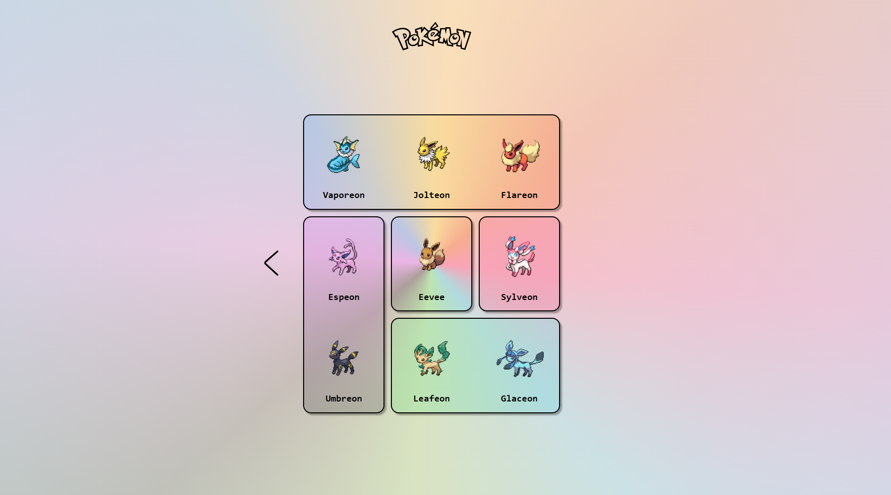

en la sesión de hoy (siguiendo el hilo de la sesión 11) se ha explicado la opción de crear un layout con grid de forma declarativa.

Se ha explicado el grid-template-areas y el grid-area para organizar las columnas y filas de una forma declarativa.

el ejemplo está en grid-2 y es una continuación del ejemplo de la sesión 11 y se puede encontrar en /sessions/session12/grid-example-continuacion  (sobretodo en declarativa.html y style3.css)

Una vez realizada la parte teorica se ha presentado una actividad.

Realiza el maquetado de la siguiente página:

